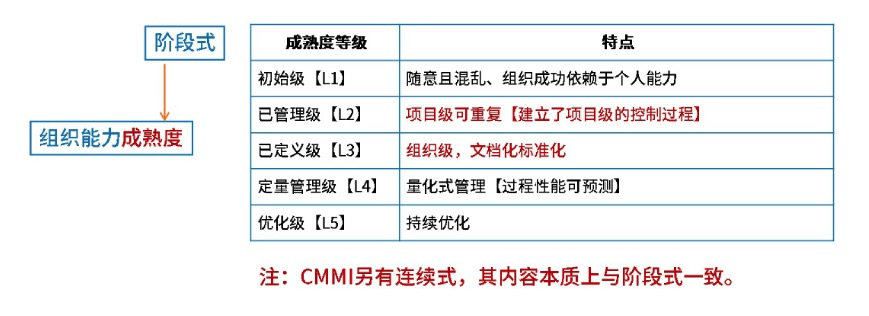
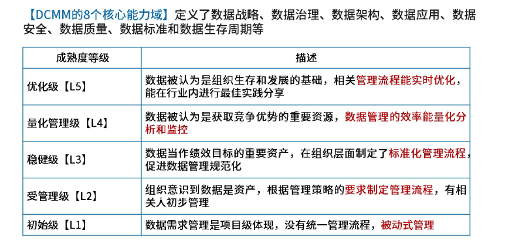

# 项目管理 

> * 进度管理 ☆
>
> * 配置管理、质量管理、风险管理

## 盈亏平衡分析

正常：销售额 = 固定成本 + 可变成本 + 税费 + 利润

平衡：销售额 = 固定成本 + 可变成本 + 税费

## 范围管理

在初步项目范围说明书中已文档化的主要可交付物、假设和约束条件的基础上准备详细的项目范围说明书，是项目成功的关键。

范围定义的输入包括：

* 项目章程

* 项目范围管理计划
* 组织过程资产
* 批准的变更申请

## 进度管理

进度管理是为了**确保项目按期完成所需要**的管理过程。

### 进度管理过程

进度管理过程一般包括：

* 活动定义

* 活动排序

* 活动资源估计

* 活动历时估计 

  > * 专家判断法
  > * 三点估算法 
  > * 功能点估算法
  > * 自上而下的估算
  > * 自下而上的估算

* 制定进度计划

* 进度控制

### 工作分解结构 (Work Breakdown Structure, WBS) 

WBS是把一个项目，按一定的原则分解成任务，任务再分解成一项项工作，再把一项项工作分配到每个人的日常活动中，直到分解不下去为止。

基本要求：

1. WBS 的工作包是可控和可管理的，不能过于复杂。
2.  任务分解也不能过细，一般原则 WBS 的树形结构不超过 6 层。
3.  每个工作包要有一个交付成果。
4.  每个任务必须有明确定义的完成标准。
5.  WBS 必须有利于责任分配。

### 关键路径法**（Critical Path Method, CPM）**

**关键路径法** 是一种用于项目管理中的 **进度规划技术**，通过分析项目中各任务的依赖关系和持续时间，确定：

- **关键路径**：项目中 **最长** 的任务序列，决定了项目的最短完成时间（总工期）。
- **非关键任务**：可以适当延迟而不影响总工期的任务。

#### 单代号网络图 PDM

#### 甘特图 （Gantt）

优点：

* 直观、简单，便于制作和便于理解
* 清晰的表示出每一项任务起始、结束时间，
* 适用小型项目
* 可用于WBS的任何层次、进度控制、资源优化、编制资源和费用计划

缺点：

* 不能系统表达一个项目包含的各项工作之间复杂关系，不能进行定量的计算和分析、优化

## 配置管理

产品配置是指一个产品在其生命周期各个阶段所产生的各种形式（机器可读或人工可读）和各种版本的**文档、计算机程序、部件及数据**的集合。

### 关于配置项

**基线配置项（可交付成果）** ：需求文档、设计文档、源代码、可执行代码测试用例、运行软件所需数据等

**非基线配置项** ：各类计划（如项目管理计划、进度管理计划）、各类报告

软件配置管理核心内容包括版本控制 和 变更控制。

## 质量管理

### 软件能力成熟度模型集成 CMMI

### 数据管理成熟度模型 - DCMM

## 风险管理

风险管理的主要目标是**预防风险**。

美国 Boehm 的软件风险管理体系，把风险管理活动分成风险估计（风险辨识、风险分析、风险排序）和风险控制（风险管理计划、风险处理、风险监督）两大阶段。该体系偏重理论。

美国 Charett e 的风险分析和管理体系，把风险分成分析（辨识、估计、评价）和管理（计划、控制、监督）两大阶段。该体系偏重理论，与 Boehm 体系接近。

美国卡内基梅隆大学软件研究所的 CMU-SEI 风险管理体系，包括 SRE 、 CRM (Continuous Risk Management)、 TRM (Team Risk Management)与 CMM 配合的软件风险管理，是基于实践的全面风险管理体系，并将软件需求方作为软件风险管理的要素。

