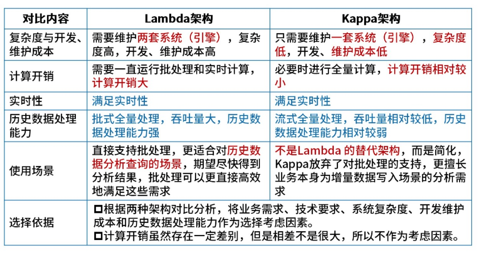

# 案例分析 -- 大数据

## 大数据技术

大数据广泛应用在制造业、服务业、交通行业、医疗行业等。

大数据特点： 5V

* 大规模 Volume
* 高速度 Velocity
* 多样化 Variety
* 价值密度低 Value
* 真实性 Veracity

大数据面临5个主要问题：

* 异构性 Heterogeneity
* 规模 Scale
* 时间性 Timeliness
* 复杂性 Complexity
* 隐私性 Privacy

大数据面临的五个方面挑战：

* 数据的获取

* 数据结构问题
* 数据集成问题
* 数据分析、组织、抽取和建模是大数据本质的功能性挑战
* 如何呈现数据分析的结果，并与非技术的领域专家进行交互

### 大数据分析步骤

1. 数据持续获取/记录，实时数据+离线数据
2. 信息抽取/清晰/注记
3. 数据集成/聚集/表现
4. 数据分析/建模
5. 数据解释 

## 大数据主要工作

### 数据采集

**工作内容：** 从多源（日志、传感器、数据库等）实时或批量采集数据

**关键技术：**

* 日志收集： Flume、Logstash、Filebeat
* 消息队列：Kafka、RabbitMQ、Pulsar（应对高吞吐）
* 数据同步：Sqoop（关系型数据库<->HDFS）、CDC（变更数据捕获）工具

### **数据存储与管理**

- **核心挑战**：解决海量数据的**高扩展性、低成本存储**和高效访问。
- **技术方案**：
  - **分布式文件系统**：HDFS（适合批处理）、对象存储（如S3）
  - **NoSQL数据库**：
    - 键值存储：Redis、DynamoDB（高并发读写）
    - 列式存储：HBase、Cassandra（稀疏大数据）
    - 文档型：MongoDB（半结构化数据）
  - **数据湖**：Delta Lake、Iceberg（支持ACID的事务性存储）

### **数据处理与计算**

- **批处理**：离线大规模数据计算（如T+1报表）
  - 框架：Hadoop MapReduce、Spark（内存加速）、Hive（SQL化）
- **流处理**：实时数据流分析（如风控、监控）
  - 框架：Flink（低延迟）、Spark Streaming、Storm（已逐渐淘汰）
- **混合处理**：Lambda/Kappa架构的实践
- **图计算**：Neo4j、GraphX（社交网络、路径分析）

###  **数据分析与挖掘**

- **交互式查询**：Presto、Impala（秒级响应OLAP查询）
- **OLAP引擎**：ClickHouse、Doris（高性能列式分析）
- **机器学习**：
  - 特征工程：Spark MLlib
  - 深度学习：TensorFlow/PyTorch与大数据平台集成（如Horovod）
- **数据挖掘**：关联规则（Apriori）、聚类（K-Means）等算法实现

Hbase：实时数据和离线数据支持

HDFS（Hadoop分布式文件系统）：通常用于处理数据离线数据的存储

Flume：分布式海量日志采集、聚合和传输的系统

Kafka：一种高吞吐量的分布式发布订阅消息系统

ZooKeeper：开放源码的分布式应用程序协调服务

## Lambda架构

批处理层（Batch Layer)：两个核心功能：存储数据集和生成Batch View

加速层(Speed Layer)：存储实时图并处理传入的数据流，更新这些视图

服务层(Serving Layer)：用于响应用户的查询请求，合并Batch View和Real-Time View中的结果数据集到最终数据集

| 优点           | 缺点                                 |
| -------------- | ------------------------------------ |
| 容错性好       | 全场景覆盖带来的编码开销             |
| 查询灵活度高   | 针对具体场景重新离线训练一遍益处不大 |
| 易伸缩、易扩展 | 重新部署和迁移成本很高               |

## Kappa架构

| 优点                                                         | 缺点                                                         |
| ------------------------------------------------------------ | ------------------------------------------------------------ |
| 统一实时和离线代码，统一数据来源，避免Lambda架构离线数据合并问题 | 消息中间件缓存的数据和回溯数据有性能瓶颈                     |
| 实时性更强                                                   | 实时数据处理时，遇到大量不同的实时流进行关联，非常依赖实时计算系统的能力，很可能因为数据流先后顺序问题，导致数据丢失 |
|                                                              | 抛弃离线数据处理模块的时候，也抛弃了离线计算更加稳定可靠的特点 |

## Lambda和Kappa对比

