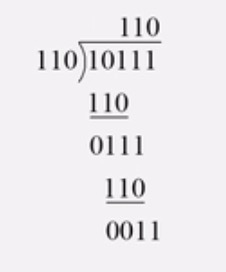

## CRC校验码 - 循环冗余校验

### 例题


### 解题思路


#### 根据多项式生成码字

#### 使用模二除法（异或操作，没有借位、进位）

相同为假（0），不同为真（1）





### ## 海明校验

2^r>= m + r + 1


## 流水线 吞吐率计算


## 三点估算法

```
期望时间 = （乐观时间 + 悲观时间 + 4 * 最可能时间）/ 6
```


## 盈亏平衡点 BEP

盈亏平衡点是 **总收入 = 总成本** 

```
某厂生产的某种电视机，销售价为每台2500元，去年的总销售量为25 000台，固定成本总额为250万元，可变成本总额为4000万元，税率为16%,则该产品年销售量的盈亏平衡点为()台(只有在年销售量超过它时才能盈利)
```


- **销售单价（P）**：2500元/台
- **去年总销售量（Q）**：25,000台
- **固定成本（FC）**：250万元 = 2,500,000元
- **可变成本总额（VC）**：4000万元 = 40,000,000元
- **税率（t）**：16%（假设为增值税率或所得税率，题目未明确，通常按增值税计算）

````
P * Q = FC + (单位VC × Q) + 税金
````


### 步骤1 计算单位可变成本

 单位VC = 40000000 / 25000 = 1600元/台

### 步骤2 形成盈亏平衡等式

```
2500x = 2500000 + 1600x + 2500 * 0.16x
根据计算可得出x = 5000
```


